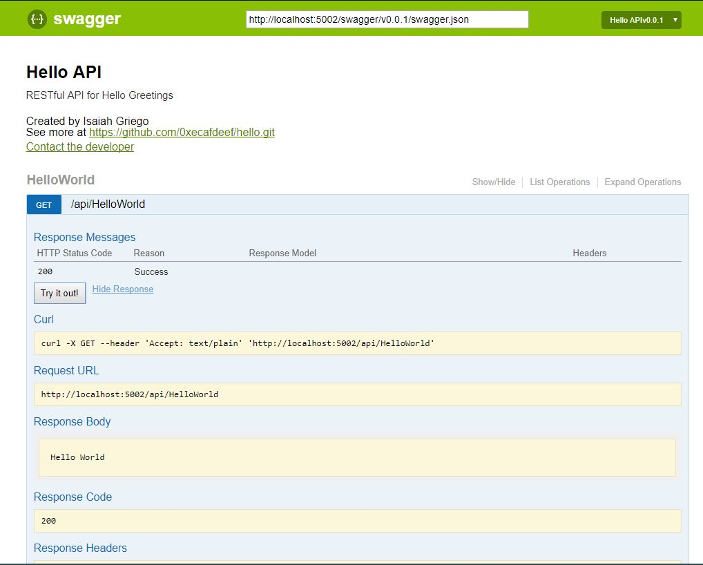

# Hello world! Coding exercise for Crowe Horwath

- [Hello world! Coding exercise for Crowe Horwath](#hello-world-coding-exercise-for-crowe-horwath)
    - [Requirements](#requirements)
    - [My Solution](#my-solution)
    - [Building](#building)
        - [WebApi](#webapi)
        - [Console App](#console-app)
    - [Testing](#testing)
    - [Running](#running)
        - [The WebApi](#the-webapi)
        - [The Console App](#the-console-app)
    - [Swagger](#swagger)

## Requirements

- Write a 'Hello World' program.
  - The program has 1 current business requirement- write 'Hello World' to the console/screen]
  - The program should have an API that is separated from the program logic to eventually support mobile applications, web applications, or console applications, or windows services
  - The program should support future enhancements for writing to a database , console application, etc.
    - Use common design patterns (inherkitance, e.g.) to account for these future concerns.
    - Use configuration files or another industry-standard mechanism or determining where to write the information to
- Write unit tests to support the API

## My Solution

I have created a dotnet core WebApi and Console App. The WebApi project lives in the `api` directory and the Console App lives in `app` directory.

## Building

### WebApi

To build the WebApi run:

```commandline
dotnet build app\app.csproj
```

### Console App

To build the Console App:

```commandline
dotnet build api\api.csproj
```

## Testing

To run the tests run:

```commandline
dotnet test tests\tests.csproj
```

## Running

### The WebApi

To run the WebApi, start it by running (from the `api` directory):

```commandline
dotnet run
```

This will start the WebApi on what is in the appsettings.json file in the URLs entry (default is <http://localhost:5002>). To interact with it Swagger UI is enable and browsing to <http://localhost:5002/swagger> will show the WebAPI generated web documentation.

### The Console App

To run the Console App you will first need to start the WebApi (see above). The configuration to the WebApi URL is in the app/appsettings.json file under ApiUrl entry (default is <http://localhost:5002/>). To execute the app run (from the `app` directory):

```command line
dotnet run
```

This will print to the console the message it receives from the Api.

## Swagger

If you have the Api running you can interact with it through the Swagger UI. Navigate to the Swagger URL (default is <http://localhost:5002/swagger>) you will see the Swagger UI.


Clicking the "Try it out!" buton will execute an HTTP GET request to the Api and return the results:

